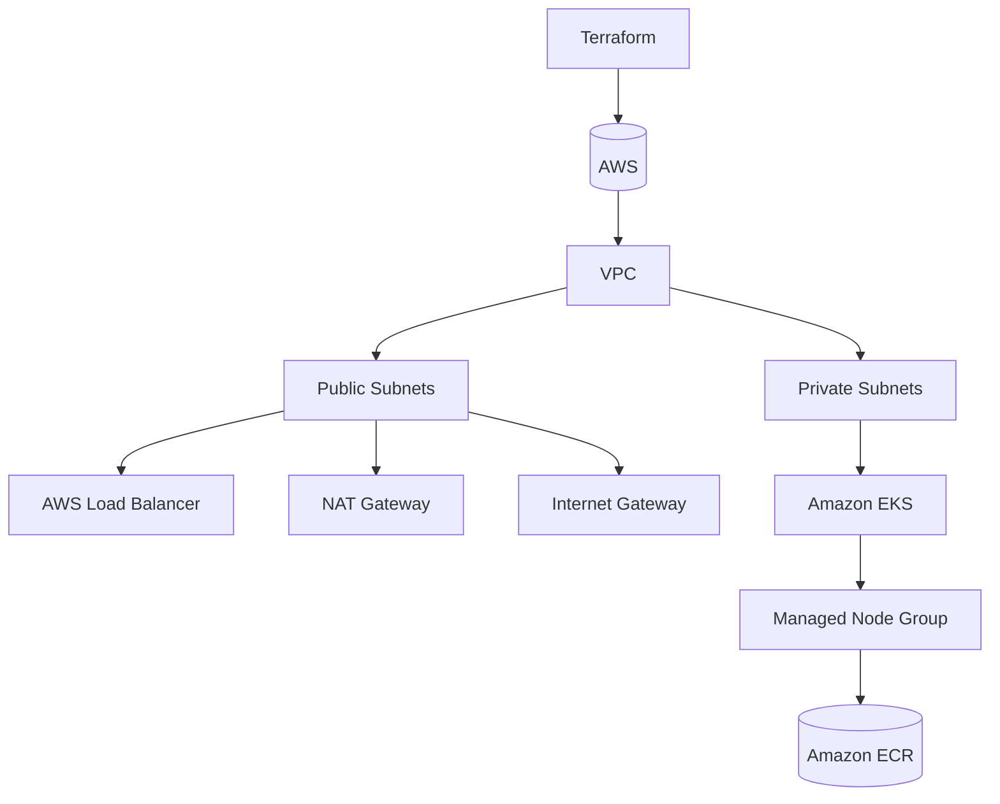

# StartTech Infrastructure as Code (Terraform)

## Overview

This repository provisions the AWS infrastructure required to run the StartTech full-stack application using Terraform.

The infrastructure is designed to support a production-ready Kubernetes environment on Amazon EKS, providing secure networking, scalable compute resources, container registry integration, and public application access through an AWS Application Load Balancer.

---

# Infrastructure Architecture



---

# Infrastructure Components

The following AWS resources are provisioned using Terraform.

| Resource | Purpose |
|----------|---------|
| VPC | Network isolation |
| Public Subnets | Internet-facing resources |
| Private Subnets | Kubernetes worker nodes |
| Internet Gateway | Internet connectivity |
| NAT Gateway | Outbound internet access for private subnets |
| Route Tables | Network routing |
| Security Groups | Network access control |
| IAM Roles | Cluster and node permissions |
| Amazon EKS | Kubernetes Cluster |
| Managed Node Group | Kubernetes worker nodes |
| Amazon ECR | Container Registry |

---

# Repository Structure

```
terraform/
│
├── main.tf
├── providers.tf
├── versions.tf
├── variables.tf
├── outputs.tf
├── terraform.tfvars.example
│
├── modules/
│   ├── networking/
│   ├── eks/
│   ├── storage/
│   ├── cdn/
│   └── ...
│
└── iam_policy.json

scripts/
└── deploy-infrastructure.sh
```

---

# Terraform Modules

## Networking

Creates:

- VPC
- Public Subnets
- Private Subnets
- Route Tables
- Internet Gateway
- NAT Gateway

---

## EKS

Creates:

- Amazon EKS Cluster
- Managed Node Group
- IAM Roles
- Security Groups

---

## Storage

Creates supporting storage resources required by the application.

---

## CDN

Creates CloudFront resources for frontend delivery where applicable.

---

# Prerequisites

- AWS Account
- Terraform >= 1.5
- AWS CLI
- kubectl
- Git

---

# Configure AWS Credentials

```bash
aws configure
```

or export environment variables

```bash
export AWS_ACCESS_KEY_ID=xxxxxxxx
export AWS_SECRET_ACCESS_KEY=xxxxxxxx
export AWS_DEFAULT_REGION=eu-west-1
```

---

# Initialize Terraform

```bash
terraform init
```

---

# Validate Configuration

```bash
terraform validate
```

---

# Preview Changes

```bash
terraform plan
```

---

# Deploy Infrastructure

```bash
terraform apply
```

---

# Destroy Infrastructure

```bash
terraform destroy
```

---

# Outputs

Terraform provides outputs including:

- VPC ID
- Public Subnets
- Private Subnets
- Cluster Name
- Cluster Endpoint
- Security Groups

---

# Authentication

After deployment, configure kubectl.

```bash
aws eks update-kubeconfig \
--region eu-west-1 \
--name starttech-cluster
```

Verify cluster connectivity.

```bash
kubectl get nodes
```

---

# Infrastructure Deployment Workflow

```text
Terraform Init
        │
        ▼
Terraform Validate
        │
        ▼
Terraform Plan
        │
        ▼
Terraform Apply
        │
        ▼
AWS Resources Created
        │
        ▼
Amazon EKS Ready
        │
        ▼
Application Repository Deploys Workloads
```

---

# Security

Infrastructure follows AWS security best practices:

- Private worker nodes
- IAM Roles
- Security Groups
- Least privilege access
- Infrastructure managed through Terraform
- Sensitive values supplied through variables rather than hardcoded

---

# Future Improvements

- Remote Terraform State (S3 + DynamoDB)
- AWS WAF
- ACM TLS Certificates
- Route53
- ExternalDNS
- Cluster Autoscaler
- Karpenter
- Prometheus
- Grafana
- ArgoCD
- Velero Backup

---

# Related Repository

Application deployment repository:

**starttech-application**

Contains:

- Frontend
- Backend
- Dockerfiles
- Kubernetes manifests
- GitHub Actions deployment pipeline

---

# Author

**Osaze Emmanuel**

DevOps Engineer

Infrastructure provisioned using Terraform for the StartTech Enterprise CI/CD on Amazon EKS assessment.
